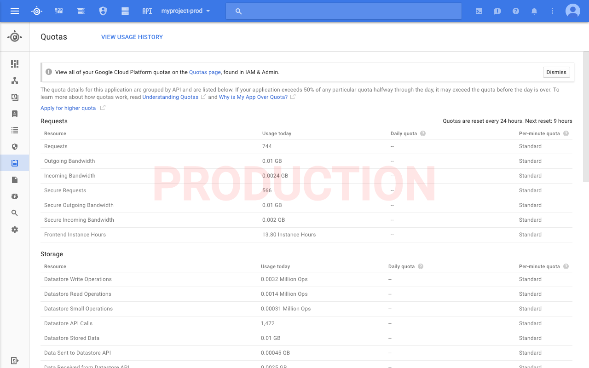

# Google Cloud Console Production Warning - Chrome Plugin #

This is a simple Chrome plugin that checks the name of the current project open in the Google Cloud Console and if it is
a production project then it shows a big red "PRODUCTION" watermark over the page.

A project is considered a production project if it ends with "-prod".

The plugin runs on all http://console.cloud.google.com pages.

## Installation ##

- Clone this repository
- Open Chrome and navigate to chrome://extensions
- Ensure "Developer mode" is enabled
- Click "Load unpacked extension..."
- Select the directory where this repository is cloned to

The extension will run automatically whenever you have the Google Cloud Console open.
